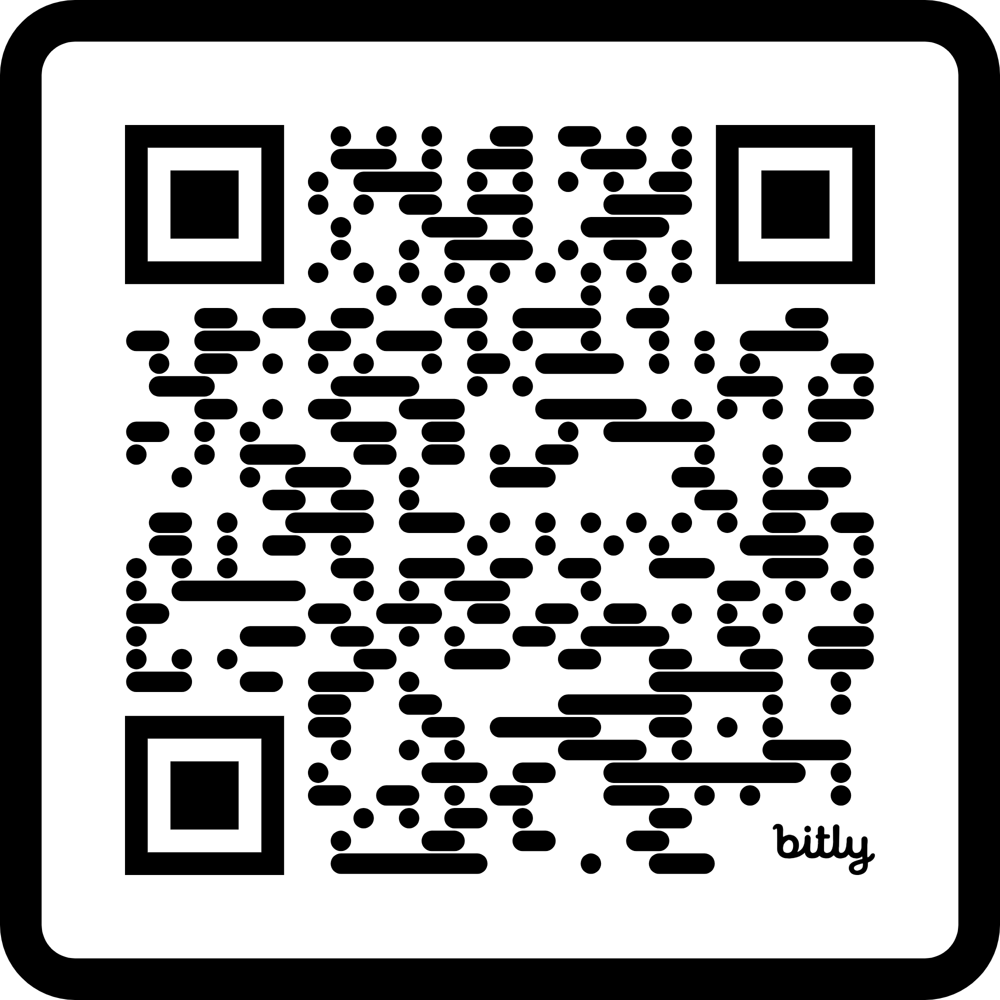

# 🧠 DepScan: ML-Powered Student Depression Assessment Platform

Depression is one of the most pressing - yet often hidden - challenges faced by students today. **DepScan** is a comprehensive machine learning platform that combines advanced XGBoost modeling with an intuitive web application to detect potential depression in students based on academic, personal, and lifestyle indicators. Our goal is not to replace clinical intervention, but to **support early, proactive, and empathetic action** from educational institutions and healthcare providers.

---

## 🌟 Live Application

**🔗 Access DepScan here:** [https://huggingface.co/spaces/gokulv7/Depression-Scan](https://huggingface.co/spaces/gokulv7/Depression-Scan)

**🔗 Short-URL for App:** [https://bit.ly/Depscan](https://bit.ly/Depscan)

**🤖 API Endpoint:** [https://gokulv7-depressionpredictor.hf.space/__docs__/](https://gokulv7-depressionpredictor.hf.space/__docs__/)

### 📱 Quick Access QR Code
<div align="center">
  
  <br>
  <em>Scan to access the DepScan web application directly on your mobile device</em>
</div>

---

## 📦 Dataset & Model Architecture

### 📊 Dataset Information
- **Source:** [Kaggle - Student Depression Dataset](https://www.kaggle.com/datasets/adilshamim8/student-depression-dataset)
- **Owner:** Adil Shamim
- **Sample Size:** 27,901 student records from Indian educational institutions
- **Target Variable:** `Depression` (Continuous: 0.0 = No Depression, 1.0 = Severe Depression)
- **Features:** 15 core variables expanding to 94 encoded features for ML processing

### 🎯 Core Features Analyzed
| Category | Features | Impact on Prediction |
|----------|----------|---------------------|
| **Demographics** | Age, Gender, City (32 cities) | Moderate |
| **Academic** | CGPA, Academic Pressure, Study Satisfaction, Degree (27 types) | High |
| **Lifestyle** | Sleep Duration, Dietary Habits, Work/Study Hours | High |
| **Mental Health** | Suicidal Thoughts, Family History, Financial Stress | Very High |
| **Professional** | Profession (13 categories), Work Pressure | Moderate |

---

## 🚀 Technical Implementation

### 🧪 Tested Machine Learning Models

| Model         | Accuracy              |
|---------------|-----------------------|
| Random Forest | 83.6%                 |
| XGBoost       | 84.3%(Final Model)    |

> _Both models were trained on 80% of the data and validated on the remaining 20%.

### 🤖 Machine Learning Pipeline
```
Raw Data → Feature Engineering → XGBoost Training → Model Validation → API Deployment
```
## Algorithm: XGBoost (Extreme Gradient Boosting)
- **Training Accuracy:** 86.5%
- **Test Accuracy:** 84.3%
- **Features:** 15 core variables (94 after encoding)
- **Model Type:** Regression with classification thresholds

### 🏗️ Architecture Stack
```
Frontend: R Shiny + Custom CSS/JavaScript
Backend: Plumber API with Vetiver Integration
ML Model: XGBoost with Bundle Support
Deployment: Hugging Face Spaces + ShinyApps.io
Logging: JSON-based prediction tracking
```

---

## 🎨 Application Features

### 🖥️ Web Interface
- **Responsive Design:** Works seamlessly on desktop, tablet, and mobile
- **Interactive Assessment:** 15-question comprehensive mental health evaluation
- **Real-time Analysis:** Instant ML predictions with detailed explanations
- **Visual Results:** Battery-style depression level indicators and color-coded risk levels

### 📊 Depression Risk Levels
| Level | Score Range | Visual Indicator | Recommendation |
|-------|-------------|------------------|----------------|
| **Minimal** | 0.0 - 0.2 | 🟢 Green | Maintain current practices |
| **Mild** | 0.2 - 0.4 | 🟡 Yellow | Consider stress management |
| **Moderate** | 0.4 - 0.6 | 🟠 Orange | Speak with counselor |
| **Severe** | 0.6 - 0.8 | 🔴 Coral Red | Seek professional support |
| **Critical** | 0.8 - 1.0 | 🔴 Dark Red | Immediate professional help |

### 🛡️ Privacy & Security
- **No Data Storage:** Assessments are processed in real-time without permanent storage
- **Anonymous Processing:** No personal identifiers required
- **Educational Purpose:** Clear disclaimers about non-diagnostic nature

---

## 📈 Model Performance & Validation

### 🎯 Accuracy Metrics
```
📊 Overall Performance:
├── Test Accuracy: 84.3%
├── Training Accuracy: 86.5%
├── Overfitting Control: Minimal (2.2% difference)
└── Cross-validation: 5-fold CV with consistent results
```

### 🔧 Model Optimizations
- **Hyperparameter Tuning:** `max_depth=6`, `eta=0.03`, early stopping
- **Feature Engineering:** One-hot encoding for categorical variables
- **Regularization:** `subsample=0.8`, `colsample_bytree=0.8`
- **Training Rounds:** 300 with early stopping at 20 rounds

---

## 💻 API Documentation

### 🌐 Available Endpoints
```
🔗 Base URL: https://gokulv7-depressionpredictor.hf.space/

├── POST /predict          # Main prediction endpoint
├── GET  /ping            # Health check
├── GET  /pin-info        # Model metadata
├── GET  /logs            # API access logs
└── GET  /prediction-logs # Detailed prediction logs
```

### 📝 Sample API Usage
```json
POST /predict
{
  "GenderMale": 1,
  "Age": 22,
  "Academic Pressure": 3,
  "Financial Stress3": 1,
  "Have you ever had suicidal thoughtsYes": 0,
  // ... other features
}

Response:
{
  "depression_score": 0.234,
  "percentage": "23.4%",
  "level": "Mild",
  "description": "Some signs of stress or mild depression",
  "recommendation": "Consider stress management techniques"
}
```

---

## 🛠️ Development Journey

### 📅 Recent Updates (July 2025)
- **✅ Model Enhancement:** Upgraded from Random Forest to XGBoost
- **✅ API Integration:** Deployed scalable Plumber API on Hugging Face Spaces
- **✅ Logging System:** Added prediction tracking and analytics endpoints
- **✅ Web Application:** Built comprehensive Shiny dashboard with responsive design
- **✅ UI/UX Improvement:** Implemented modern CSS animations and mobile optimization
- **✅ Performance Optimization:** Fixed dropdown overlapping and cross-browser compatibility

### 🔄 Version History
| Version | Date | Key Changes |
|---------|------|-------------|
| v1.0 | June 2025 | Initial Random Forest model |
| v2.0 | June 2025 | XGBoost implementation + hyperparameter tuning |
| v3.0 | July 2025 | API deployment & comprehensive logging |
| v3.1 | July 2025 | Shiny web application with modern UI |

---

## 🎯 Use Cases & Applications

### 🏫 Educational Institutions
- **Early Warning System:** Integrate into student wellness programs
- **Orientation Screening:** Identify at-risk freshmen during orientation
- **Academic Support:** Correlate mental health with academic performance
- **Resource Allocation:** Data-driven counseling service planning

### 👥 Mental Health Professionals
- **Screening Tool:** Initial assessment before clinical evaluation
- **Progress Tracking:** Monitor student well-being over time
- **Research Platform:** Analyze depression trends in student populations
- **Intervention Planning:** Risk-stratified mental health interventions

### 📊 Research & Policy
- **Population Studies:** Large-scale mental health analytics
- **Intervention Effectiveness:** Measure impact of mental health programs
- **Policy Development:** Evidence-based mental health policy creation
- **Cross-cultural Validation:** Adapt model for different populations

---

## 🚦 Getting Started

### 🖥️ For End Users
1. **Visit:** [DepScan Web Application](https://bit.ly/Depscan))
2. **Complete:** 15-question mental health assessment (takes 3-5 minutes)
3. **Review:** Instant ML-powered depression risk analysis with visual indicators
4. **Follow:** Personalized recommendations based on your results

### 👨‍💻 For Developers
```bash
# Clone the repository
git clone https://github.com/your-username/DepScan

# Install dependencies
install.packages(c("shiny", "xgboost", "vetiver", "plumber", "httr", "jsonlite"))

# Run the model training
source("studep_xgb_model.R")

# Launch the Shiny app locally
shiny::runApp("app.R")

# Start the API server
plumber::plumb("plumber.R")$run(port=7860)
```

### 🔧 API Integration Example
```r
# Example R integration
library(httr)
library(jsonlite)

# Sample assessment data
assessment_data <- list(
  "GenderMale" = 1,
  "Age" = 22,
  "`Academic Pressure`" = 3,
  # ... other features
)

# Make API call
response <- POST(
  "https://gokulv7-depressionpredictor.hf.space/predict",
  body = toJSON(list(assessment_data)),
  add_headers("Content-Type" = "application/json")
)

# Parse results
result <- fromJSON(content(response, "text"))
print(paste("Depression Risk:", result$level, "-", result$percentage))
```

---

## 📁 Repository Structure

```
DepScan/
├── 📊 Data/
│   └── student_depression_dataset.csv
├── 🤖 Model Deployment/
│   ├── studep_xgb_model.R          # Model training script
│   ├── my-pins/                     # Vetiver model artifacts
│   └── plumber.R                    # API server code
|   ├── Dockerfile                   # Container configuration
├── 🎨 Application/
│   ├── app.R                        # Shiny web application
│   └── Dockerfileforapp             # Container configuration
├── 📚 Documentation/
│   ├── README.md                    # This file


```

---

## 🔬 Model Interpretability

### 🎯 Feature Importance Analysis
*Based on XGBoost feature importance calculations during model training:*

Our model analyzes relationships between various student characteristics and depression risk. The most influential factors identified include:

1. **Academic Pressure** - Primary stress indicator in educational settings
2. **Mental Health History** - Including suicidal thoughts and family history
3. **Financial Stress** - Socioeconomic pressures affecting mental well-being
4. **Sleep Patterns** - Critical lifestyle health indicators
5. **Study Satisfaction** - Academic fulfillment and engagement levels

### 🧠 Model Insights
- **Academic factors** show strongest correlation with depression risk
- **Sleep patterns** serve as reliable lifestyle indicators
- **Financial stress** significantly impacts mental health in students
- **Gender and age** influence depression manifestation patterns
- **Family history** provides important genetic predisposition context

---

## ⚠️ Ethical Considerations & Limitations

### 🛡️ Privacy Protection
- **No Personal Data Storage:** Assessments processed without retention
- **Anonymous Usage:** No login or personal information required
- **Secure Processing:** HTTPS encryption for all data transmission
- **Transparent Operations:** Open-source model and clear methodology

### 📋 Important Disclaimers
> **⚠️ Not a Medical Diagnostic Tool:** DepScan is designed for educational and screening purposes only. It is **not a substitute for professional medical diagnosis or treatment**. If you are experiencing mental health concerns, please consult a qualified healthcare professional immediately.

### 🌍 Cultural Considerations
- **Dataset Limitation:** Trained primarily on Indian student population
- **Cultural Context:** Results may vary across different cultural backgrounds
- **Language Bias:** Optimized for English-speaking populations
- **Validation Needed:** Requires cross-cultural validation for global deployment

### 🎯 Model Limitations
- **Temporal Factors:** Depression can fluctuate; single assessment may not capture full picture
- **Self-reporting Bias:** Relies on honest self-assessment from users
- **Population Scope:** Optimized for student populations (ages 16-65)
- **Update Frequency:** Model requires periodic retraining with new data

---

## 📊 Performance Monitoring & Analytics

### 📈 Real-time Analytics
The application includes comprehensive logging and monitoring:
- **Prediction Tracking:** All assessments logged with timestamps
- **Usage Analytics:** API endpoint usage statistics
- **Error Monitoring:** Automatic error detection and logging
- **Performance Metrics:** Response time and accuracy tracking

### 🔍 Quality Assurance Features
- **Input Validation:** Comprehensive data validation before prediction
- **Error Handling:** Graceful degradation with informative error messages
- **Model Versioning:** Track model updates and performance changes
- **A/B Testing Ready:** Framework for testing model improvements

---

## 🤝 Contributing & Collaboration

### 💡 How to Contribute
We welcome contributions from:
- **Mental Health Professionals:** Clinical insights and validation
- **Data Scientists:** Model improvements and feature engineering
- **UX/UI Designers:** Interface enhancements and accessibility
- **Students:** Feedback on user experience and cultural sensitivity

### 📧 Contact & Support
- **LinkedIn:** [Gokul V](https://www.linkedin.com/in/gokulv17/)
- **GitHub Issues:** [Report bugs or request features](https://github.com/GokulV7/DepScan/issues)

---

## 🙏 Acknowledgments

### 📚 Data Source
Special thanks to **Adil Shamim** for compiling and sharing the comprehensive student depression dataset via Kaggle:  
🔗 [Student Depression Dataset on Kaggle](https://www.kaggle.com/datasets/adilshamim8/student-depression-dataset)

### 🛠️ Technology Stack
- **R Ecosystem:** Shiny, Plumber, Vetiver for rapid development
- **XGBoost:** High-performance gradient boosting framework
- **Hugging Face Spaces:** Reliable API deployment and hosting
- **ShinyApps.io:** Scalable web application hosting
- **Open Source Community:** Various R packages and libraries

---

## 📜 License

This project is released under the MIT License - see the LICENSE file for details.

---

## 🌟 Future Roadmap

### 🔮 Planned Enhancements
- **Multi-language Support:** Expand accessibility to non-English speakers
- **Longitudinal Tracking:** Allow users to track progress over time
- **Integration APIs:** Connect with existing student information systems
- **Mobile Application:** Native mobile app for improved accessibility
- **Advanced Analytics:** Institutional dashboards for administrators

### 🌍 Global Expansion
- **Cross-cultural Validation:** Test model across different cultural contexts
- **Multi-national Training:** Incorporate diverse student populations
- **Localization:** Adapt assessment questions for different educational systems
- **Regulatory Compliance:** Ensure GDPR, HIPAA compliance for different regions

### 🔬 Research Opportunities
- **Temporal Analysis:** Study depression trends over academic years
- **Intervention Studies:** Measure effectiveness of mental health programs
- **Predictive Modeling:** Early warning systems for academic institutions
- **Population Health:** Large-scale mental health surveillance

---

## 📞 Emergency Resources

If you or someone you know is experiencing a mental health crisis:

### 🇺🇸 United States
- **National Suicide Prevention Lifeline:** 988
- **Crisis Text Line:** Text HOME to 741741

### 🇮🇳 India
- **AASRA:** +91-9820466726

### 🌍 International
- **International Association for Suicide Prevention:** [https://www.iasp.info/resources/Crisis_Centres/](https://www.iasp.info/resources/Crisis_Centres/)

---

> _"Let's make mental health support more proactive, data-driven, and compassionate. Together, we can build a future where every student has access to early mental health insights and support."_

---

**⭐ Star this repository if DepScan helped you or your organization support student mental health!**

[](https://github.com/GokulV7/DepScan)
[](https://github.com/GokulV7/DepScan/fork)
[](https://github.com/GokulV7/DepScan/issues)
[](https://github.com/GokulV7/depscan/blob/main/LICENSE)
